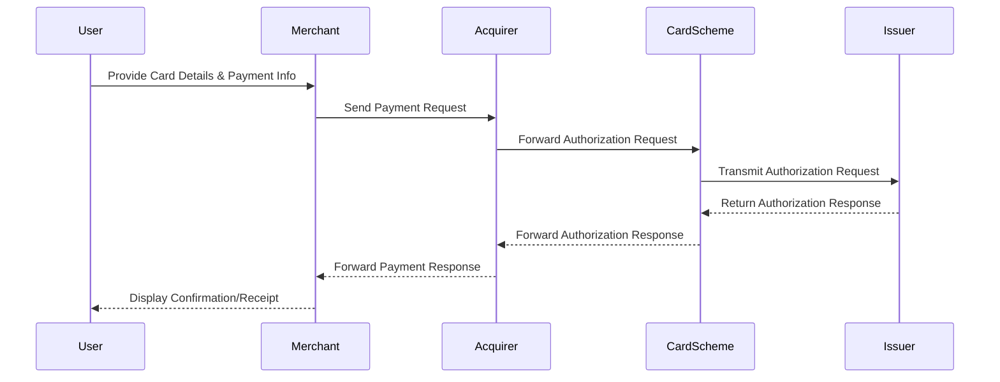
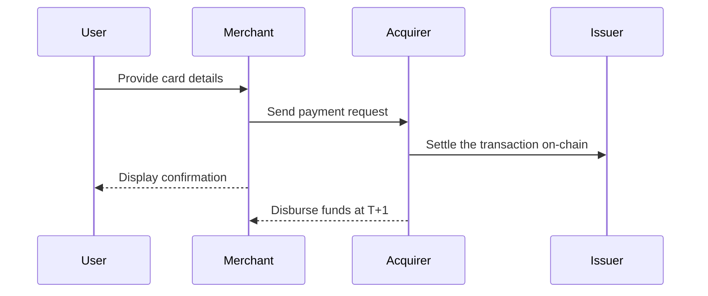
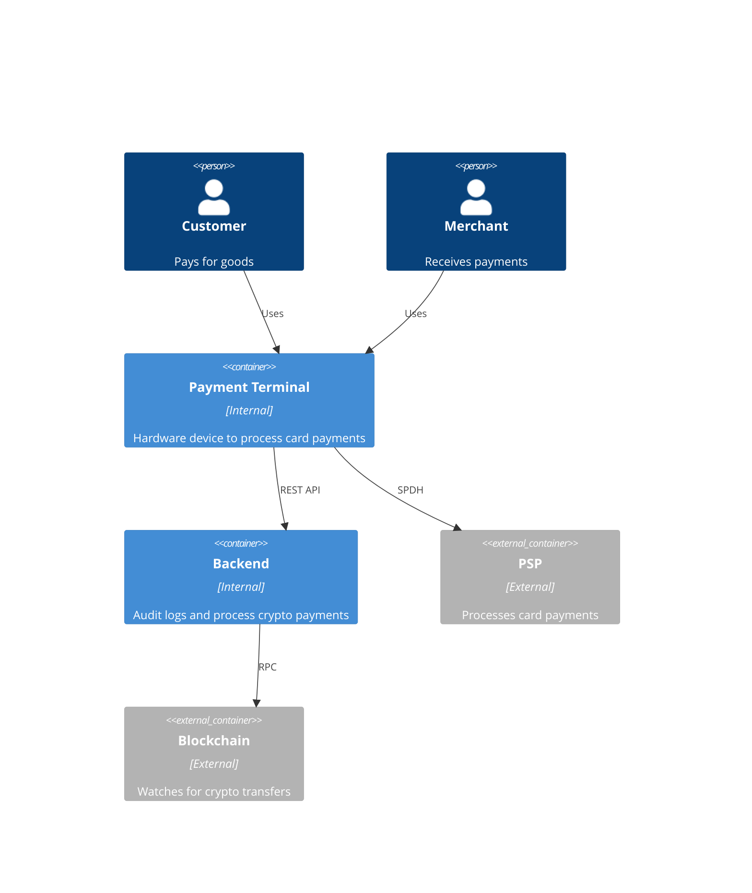
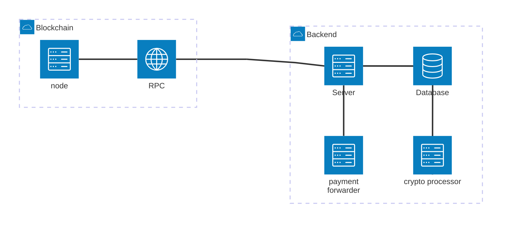
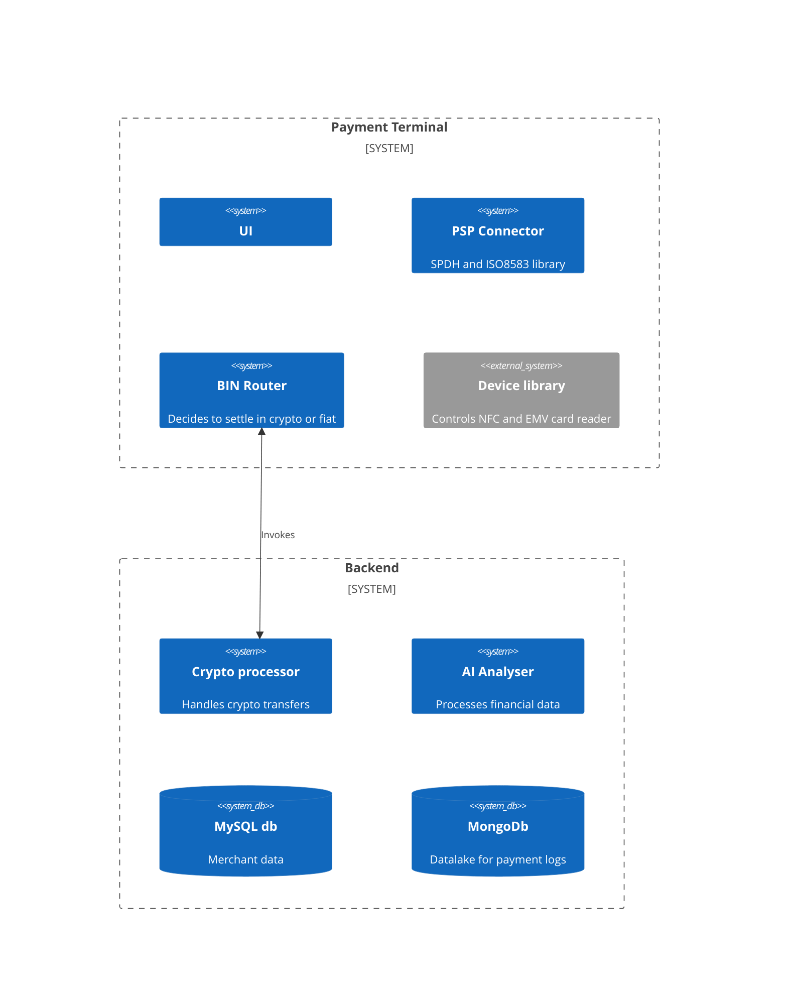

# Rooter - Whitepaper

**TL;DR**

Rooter is a payment terminal that minimises processing costs through internal payment routing while offering superior inventory, customer management, and customised incentive program tools.

It features a dual‑mode POS that automatically detects and processes both traditional card transactions (via the schema, Visa/Mastercard/Amex) and crypto transactions via blockchain settlement (thus skipping the schema fees), dynamically choosing the optimal payment route without any manual input required.

Rooter also provides a cloud POS to manage inventory/SKU and customer retention; for sales and inventory analytics tools we use financial modelling and a LLM to make the numerical results into user-friendly action items.

**How**

- creating a dual‑mode POS that automatically detects and processes both traditional cards via the schema (Visa/Mastercard) and crypto cards (via blockchain settlement). The terminal dynamically selects the optimal payment path for each transaction without requiring any manual input.
- integrating with crypto cards (Gnosis pay, Kulipa, Holyheld) to process transactions on-chain
- developing top-notch cloud-based merchant SKU and product management.

> *re-purposing a white label and EMV lvl1 and 2 certified payment terminal*

**Why Malta**

- Niche market, 500k stable inhabitants + 3m annual tourists, mostly dominated by small brick&mortar shops like restaurants, bars and hotels
- Part of the EU, the solution can be exported in the rest of the EEA with license passporting
- Fintech sandbox

**Revenue stream**

- One-off hardware sales of the dual‑mode terminal
- Recurring revenue through fee waiver subscription plans for high-volume merchants, which further incentivizes cost-efficient processing
- Subscription-based analytics tools for merchants.

**Why crypto**

- can directly settle the transaction on-chain, skipping the card schema (Visa or Mastercard)
- composability (can buy a tokenised MMF or tap into DeFi yields)
- cross-border money remittance is cheaper

**Sexy tech:**

- Payment terminal supporting any card type, QR and NFC payments with extra plugins (plugin example: integration to accept crypto payments via hardware wallet tap-to-pay)
- DLT settlement by receiving the on-chain funds from the user account to the settlement account, the only fee is then the blockchain gas cost
- Leverage ERC20 and ERC721 (NFT) tokens to create a secondary market for points and coupons

## Introduction

In recent years, the financial technology (fintech) sector has undergone significant transformation, introducing innovative solutions that cater to the evolving preferences of modern consumers. Neobanks like Revolut and N26 have disrupted traditional banking by offering seamless, user-friendly digital experiences. Similarly, services such as SumUp and Square have redefined the purchasing process through more affordable and customised Points of Sale (POS) hardware, and the rise of stablecoins has introduced even more ways to handle digital payments. Despite these advancements, the payment industry remains largely unchanged, retaining models and practices reminiscent of the 1990s.

This stagnation is particularly evident among younger generations. Studies indicate that Generation Z and millennials exhibit a marked reluctance towards changing payment habits, especially within Europe. For instance, only 42% of Gen Z consumers reported using a credit card in the last 90 days, compared to 74% of baby boomers and seniors. [1](https://www.pymnts.com/credit-cards/2023/younger-consumers-less-likely-use-credit-cards/) This trend is further underscored by a preference for alternative payment methods; 65% of Gen Z prefers using debit cards over credit, reflecting a cautious approach to debt accumulation, [2](https://www.swipesum.com/insights/gen-z-and-the-future-of-payments-cards-cash-and-the-shift-to-digital) with tap-to-pay being dominant as opposed to swipe or chip-and-PIN transactions.

In Malta, payment trends reflect global patterns, with younger demographics showing limited engagement with traditional credit card products. This creates a unique opportunity to introduce novel point-of-sale and payment methods that align with the digital expectations and financial habits of today’s consumers, offering seamless, cost-efficient, and customer-centric solutions.

The financial landscape in Malta is undergoing a significant transformation, with notable growth in the fintech sector and evolving consumer preferences in payment methods. A 2022 report by McKinsey & Company highlights Malta as one of the top performers in fintech activity, noting significant advancements in founding, funding, and scaling within the sector. [3](https://www.mondaq.com/fin-tech/1263652/malta-among-top-fintech-performers-mckinsey)

Despite this progress, traditional payment methods remain prevalent among Maltese consumers. A 2018 survey by the Central Bank of Malta revealed that cash is still the preferred payment instrument for various transactions, including groceries and utility bills. Additionally, cheque usage in Malta stands at 17.3%, significantly higher than the EU average of 1.7%. [4](https://gemma.gov.mt/wp-content/uploads/2020/05/Central-Bank-of-Malta-Analysis-of-the-Payment-Habits.pdf)

A 2023 Central Bank of Malta study shows cash usage has declined to 63% for in-person transactions, while cheque usage dropped to 12%. Digital wallet adoption grew to 21%, driven by tourists and Gen Z.

### Consumer behaviour is changing

However, there is a gradual shift towards digital payments. The same survey indicated increased accessibility to online payments, direct debits, and prepaid cards between 2013 and 2018. Furthermore, the digital payments market in Malta is projected to grow by 5.03% between 2025 and 2028, reaching a market volume of US$1,513 million by 2028. [5](https://www.statista.com/outlook/dmo/fintech/digital-payments/malta)

Recent studies further indicate a shift in consumer payment preferences. A 2023 survey by the European Central Bank found that while cash remains a widely used payment method, there is an increasing preference for digital payments among euro area consumers, with cards being the most frequently used instrument for online payments. [6](https://www.ecb.europa.eu/stats/ecb_surveys/space/html/ecb.space2024~19d46f0f17.en.html)

**Consumers prefer tap-to-pay**

In Europe, the payments landscape is experiencing a significant shift towards digital and card-based transactions, particularly in in-person settings. Recent data indicates that card payments have risen to 39% of all transactions, up from 34% two years prior. Simultaneously, mobile payments have doubled to 6%, while cash usage has declined from 59% to 52% over the same period. 

This trend is further supported by the increasing adoption of contactless payments, fueled by the Covid pandemic in 2020. In the first half of 2023, the number of contactless card payments in the euro area increased by 24.3% to 20.9 billion, with the total value rising by 25.9% to €0.5 trillion. These payments accounted for 69% of all non-remote card transactions during this period.  Despite the rise in digital payments, cash remains a significant payment method in certain regions. For instance, in Germany, consumers still use cash for approximately 51% of transactions, although this represents a decline from previous years. 

These developments highlight a clear consumer shift towards digital and card-based payment methods across Europe, with a notable increase in contactless and mobile payment adoption.

## The Fintech Ecosystem in Malta

Malta's fintech industry is expanding rapidly, driven by supportive regulatory frameworks and a proactive approach to digital innovation. The Malta Financial Services Authority (MFSA) reported that over 50% of surveyed financial services entities have initiated digital transformation efforts, aiming to enhance efficiency and customer engagement[7](https://www.mfsa.mt/publication/study-reveals-digital-transformation-and-fintech-adoption-in-maltese-financial-services-sector/).

To support this digital transition, the Malta Financial Services Authority (MFSA) has established a FinTech Regulatory Sandbox. This initiative provides a controlled environment where fintech operators can test their innovations within the financial services sector under specific conditions, fostering sustainable financial innovation and ensuring regulatory certainty. [8](https://www.mfsa.mt/fintech/regulatory-sandbox/)

The digital payments segment remains a significant contributor to this growth. In 2024, the total transaction value in Malta's digital payments market is projected to reach approximately $1.19 billion, with an expected annual growth rate of 6.28% from 2024 to 2028, culminating in a market volume of around $1.51 billion by 2028[9](https://www.statista.com/outlook/dmo/fintech/digital-payments/malta).

## Rooter

### Pain Point

**Merchant fees are still too high**

Merchants in Malta, particularly small businesses such as cafés, restaurants and retail shops, face significant challenges with the current payment processing landscape. **Traditional point-of-sale (POS)** solutions like SumUp, Square, and myPOS **impose transaction fees ranging from 1.5% to 2.5%**, which eat into already narrow profit margins. These fees are **particularly impactful for low-value transactions**, such as purchasing a coffee or a meal, where the merchant's premium is minimal. As a result, many merchants struggle to maintain profitability while accepting card payments, which have become an essential service for customers.

**Unsofisticated merchant tooling**

Additionally, the current payment infrastructure leaves little room for merchants to implement customer retention strategies. With the majority of their margins consumed by processing fees, merchants find it financially unfeasible to offer incentives like cashback, loyalty points, or tailored discounts that could foster customer loyalty and repeat business. This lack of flexibility in the payment system not only affects merchant profitability but also limits their ability to differentiate in a competitive market. The combination of high costs, limited incentives, and operational inflexibility creates a pressing need for a solution that aligns with the realities of small-scale businesses and their customers.

**User benefits are low to inexistent**

Malta's payment market is failing to keep pace with the digital transformation seen in other areas of fintech. With a declining adoption rate among younger generations and a growing preference for alternative payment methods, traditional payment instruments are increasingly perceived as outdated. Existing reward-based cards, such as American Express, often cater to older demographics with benefits like travel perks and luxury services, which hold limited appeal for Gen Z and millennials[7](https://www.thetimes.co.uk/article/american-express-hails-benefits-of-youth-gvkm6stpl). This leaves a significant gap in the market for a solution that combines the flexibility of modern payment technologies with rewards and benefits tailored to the interests and lifestyles of younger, tech-savvy consumers.

### Mission & Vision

Rooter wants to make payments simple, affordable, and rewarding for merchants and customers alike.

**Vision**

To revolutionise the payment processing industry in Malta by creating a seamless, cost-effective and customer-centric ecosystem that empowers small merchants to thrive leveraging DLT and AI. We envision a future where merchants and customers alike benefit from a transparent payment infrastructure that minimises fees, maximises value and fosters loyalty through cashback and reward solutions.  

**Mission**

Our mission is to develop a cutting-edge payment acquirer and proprietary terminal system that significantly reduces transaction costs for merchants while enabling them to implement effective user retention strategies via custom tools. By leveraging modern payment technologies and leveraging a data-centric approach, we aim to create a robust POS that transforms everyday transactions into opportunities for growth, savings and enhanced customer satisfaction.  

### Market Opportunity

Developing a payment acquirer with proprietary terminals in Malta presents a significant market opportunity, particularly among small merchants such as bars, restaurants and retail shops. These businesses are often burdened by transaction fees ranging from 1.5% to over 2% of sales value, with 80% of merchants paying fees based on transaction value[10](https://www.smechamber.mt/wp-content/uploads/2020/09/Merchant_Report-Survey.pdf). Their inventory management tools are very basic and often times not connected to the rest of the payment stack.
A modern payment solution that integrates digital functionalities, personalised rewards and aligns with the evolving preferences of Maltese consumers could effectively bridge the gap between traditional POS offerings and contemporary financial needs of both customers and merchants alike.

In 2020, the total value of card transactions in Malta was approximately €1.2 billion, with an average transaction value of €51, indicating a high volume of low-value transactions. Given that micro and small enterprises constitute about 94% of active businesses in Malta, focusing on this segment could facilitate market penetration and adoption[11](https://businessnow.mt/maltese-smes-continue-to-dominate-share-of-active-business-units).

**Market potential estimates**

| Indicator | Value | Notes |
|---|---|---|
| **TAM** | 1.2bn€ | Total value of card transactions in Malta (2020[12](https://www.maltatoday.com.mt/business/business_news/113529/bank_cards_increasingly_used_for_low_value_purchases))  |
| **SAM** | 1.13bn€ | Assuming 94% of transactions are from micro and small enterprises (94% of 1.2bn)  |
| **SOM** | 113m€ | Targeting 10% adoption among small merchants in the initial phase (10% of 1.13bn) |

These estimates suggest that by strategically focusing on small merchants, the payment solution could capture a significant share of the Maltese card payment market, leading to substantial savings for merchants and attractive cashback incentives for consumers. Competitors like SumUp achieved 8% merchant penetration in Malta within 2 years. Rooter targets 10% by focusing on low-cost hardware and partnerships with Malta Hotels and Restaurants Association (MHRA).

### The Product

### Product Description

Rooter offers an innovative DLT-based payment acquirer backend integrated with open source certified payment terminals designed to facilitate transaction routing and data analytics for merchants in Malta. The solution eliminates the need for multiple intermediaries in the payment processing chain, significantly reducing transaction fees from 1-3% to 0.5% (see *financials* section for the precise calculations*). The system is integrated with industry standard protocols, such as ISO8583, to be compatible with Visa and Mastercard, as well as a novel open source RFID-based payment method developed by a consortium of small fintech of which Rooter is part of in order to be retrocompatible with other payment systems like PIX or WeChat.

The payment terminal is intuitive and tailored to the needs of small merchants, such as cafés, restaurants, and retail shops. It simplifies the payment process, supporting contactless, chip-and-pin, mobile wallet and RFID (non Visa/MC) transactions, ensuring merchants can cater to the diverse payment preferences of their customers. The physical device is built on an integrated, dual‑mode platform that incorporates all essential functionalities directly into its core firmware. By eliminating external plugins, we simplify certification (including PCI-DSS) and reduce integration complexity while ensuring a seamless, secure and scalable solution.

By leveraging AI, the solution not only reduces transaction fees but also empowers merchants to implement data-driven customer retention strategies. **Financial modeling tools can analyse transactional patterns, identify customer preferences, and recommend optimal loyalty programs or cashback offers while LLMs can transform numbers into simple, actionable items**. For example, focus oj upsell opportunities (*customers who buy pastries often add orange juice—prompt a combo discount*) or highlight peak hours (*shift staffing to 3–6 PM based on foot traffic data*).
This enables merchants to deliver personalised and meaningful incentives that enhance customer loyalty and drive repeat business, creating a competitive edge in the market. 

Combining reduced fees with data-driven retention tools positions this payment solution as an essential partner for Malta's small merchants in achieving sustainable growth and profitability.

### Unique Value Proposition

1. **Cost Efficiency for Merchants:** Our system drastically reduces transaction fees for "card-on-us" payments, with rates as low as 0.2% in the EEA. This ensures small businesses retain more revenue, empowering them to focus on growth and operational investments. With AI tools, they can observe and optimise in real time offers, cashback and points programs to increase their sales funnels.

> The go to market solution is specifically designed to minimize costs for low-value transactions, such as coffee, meals, and other everyday purchases, where traditional payment fees can disproportionately erode profits.

2. **Increased Customer Loyalty:** By enabling features such as cashback, loyalty points, and tailored discounts, our solution transforms simple payment processing into a tool for customer retention. These capabilities help merchants foster loyalty and boost repeat business, giving them a competitive edge.

3. **Merchant Tooling:** Merchants can manage their inventory, analyse sales and customer retention from a unique dashboard.
The underlying AI identifies trends (e.g., "30% of café customers buy pastries after 3 PM") and recommends actions (e.g., "Offer a free coffee after 5 purchases"). Data is anonymised in a GDPR-compliant way.

#### Example reward program

**Points System:**  
Merchants using Rooter can design their own reward programs, allowing customers to earn points on every transaction. These programs encourage customer loyalty while driving repeat business. For instance:  
- **5 points per €1 spent** directly at the merchant's establishment.  
- **1 point per €1 spent** on transactions made elsewhere within the Rooter network.

**Customisable Redemption Model:**  
Unlike generic reward systems, merchants can offer unique and relevant rewards tailored to their business and customer base. Examples include:  
- **Discount vouchers** for use on future purchases at the merchant's store.  
- **Exclusive experiences**, such as private tastings or VIP access to events hosted by the merchant.  
- **Loyalty perks**, like free items after a certain number of visits or cumulative spending thresholds.  

**Points Flexibility:**  
Customers can redeem points at their convenience or even trade them within a secondary marketplace managed by Rooter. This ensures that rewards are never wasted:  
- **Resell or transfer points:** Customers who no longer need the merchant's rewards can resell their points, allowing others to benefit from the program.  
- **Convert points:** Points could be converted into credits for other services or even used as partial payment at participating establishments.
- **Cross-merchant rewards:** Points earned at one participating merchant (e.g., a restaurant) can be redeemed at a partner venue (e.g., a local retail store or fitness studio).

### Customer Segmentation

Rooter targets a diverse audience with a shared desire for innovative, cost-effective, and customer-centric payment solutions. By understanding the specific characteristics, needs, and behaviors of these customer groups, Rooter can tailor its offering to drive adoption and long-term growth. Below is a detailed segmentation of the potential customer base:

| **Segment**         | **Description**                                                                                     | **Demographic**                                                                                       | **Psychographic**                                                                                                 |
|----------------------|-----------------------------------------------------------------------------------------------------|-------------------------------------------------------------------------------------------------------|------------------------------------------------------------------------------------------------------------------|
| **Small Business Owners** | Merchants seeking to reduce transaction costs and improve profitability.                         | Owners of cafés, restaurants, retail shops, aged 30-60, medium income.                                 | Cost-conscious, value efficiency, and open to innovative solutions that improve their bottom line.                |
| **Digital-Native Entrepreneurs** | Tech-savvy individuals managing modern businesses or startups.                                   | Aged 25-40, urban residents, medium to high income.                                                   | Prefer streamlined, technology-driven solutions that enhance operational efficiency and customer engagement.       |
| **Expats in Malta**  | Foreign professionals operating small businesses or managing local shops.                            | Aged 30-50, medium income, often recently settled.                                                    | Seek simple, adaptable payment systems without high costs or complex onboarding.                                  |
| **Freelancers and Solopreneurs** | Individuals handling low-ticket transactions with clients or customers.                              | Aged 25-50, varying income levels, often working remotely.                                             | Value affordability, ease of use, and tools that help attract and retain customers.                               |
| **Cashback Enthusiasts** | Consumers looking to maximize value from their everyday transactions.                                   | Aged 20-50, medium to high income, active card users.                                                  | Motivated by rewards, loyalty perks, and cost savings, especially on low-value purchases.                         |

#### Priority Ranking:

* Phase 1 (Launch): Small Business Owners (cafés, retail) → Freelancers
* Phase 2 (6–12 Months): Digital-Native Entrepreneurs → Expats
* Phase 3 (Year 2): Cashback Enthusiasts (tourist-focused campaigns).

## The Tech

Rooter’s core technology is built around a robust dual‑mode routing engine and blockchain settlement layer, which are our highest priorities. Traditional payment processing and crypto transaction routing are handled by this central engine. Secondary features, such as AI-driven analytics for merchant insights and loyalty program optimization, will be integrated in later phases once the core system is fully operational.

- **DLT and EMTs**: EMTs are used to process settlement and to store users' funds, that are invested in EU-based regulated MMFs and marginally in DeFi according to common reporting standard principles. The yield deriving from the MMF is then given back to users as cashback. Directly giving yield to users would be violating the EMI regulations.

- **AI-Driven Analytics**: A custom-trained LLM analyzes raw transaction data to provide insights into customer behavior for merchants in order to taylor eventual reward programs.

- **Transferrable Points**: DLT benefits also come in the flexibility of rewards. Points can be represented as fungible tokens and sold on a secondary market, or swapped for points from other merchants, to prevent vendor lock-in, one of the most criticised parts of American Express business model.

### Payment Processing Workflow

- **Transaction Initiation**: Users initiate payments through the Rooter mobile app or POS devices.

- **Authentication**: Open banking APIs authenticate user credentials, ensuring secure access to linked bank accounts.

- **Transaction Recording**: Once authenticated, the payment details are encrypted and recorded on the distributed ledger, ensuring data integrity and transparency.

- **Settlement**: Funds are transferred between accounts in real-time, facilitated by the open banking network, ensuring immediate availability of funds.

### Key concepts in on-chain card settlement

* *Authorization*: A request to confirm if sufficient cash is available.
* *Clearing*: Card networks finalize the transaction details at the end of the day.
* *Settlement*: Funds are transferred from the user's account to the merchant’s bank via offramps. Stablecoins are EUR-pegged (e.g., EURC) to avoid volatility. Escrow releases funds within 2 hours post-authorization to align with merchant cashflow needs while maintaining a window for customer chargebacks.

Web3 card payment processors generally use smart contracts. Their programmability allows advanced functionality like relaying txs usig session keys, setting temporary limits or freezing money, in order to hold assets securely during the settlement process. These session keys are designed to only handle a certain token transfer (for instance USDC) with given limits (like 1000 USDC a day max), ensuring security and compliance while facilitating the transfer to the merchant.

Externally-owned accounts, including wallets like Metamask and Coinbase Wallet, present a different set of challenges. These wallets are not programmable and cannot enforce smart policies like freezing assets. To address this, Kulipa introduces an escrow account into the flow of funds. Immediately after a transaction is authorised, the corresponding funds are moved into escrow. This ensures that money is secured and available for settlement, eliminating the risk of double spending. The escrow account acts as a safeguard, providing a practical workaround for the limitations of EOA wallets.

### Flow of Funds

#### Traditional
In the case of account abstraction wallets, the flow of funds involves several key steps. When a user initiates a transaction, the card processor checks the balance in their wallet and confirms authorization. The wallet then holds the funds using its cosigner system until the card network clears the transaction. Finally, the backend transfers the funds from the user's wallet to the merchant's account through offramps. This structured approach leverages the programmability of smart contracts to ensure seamless and secure transactions.

For externally-owned accounts, the process requires the immediate transfer of funds into an escrow account once authorisation is granted. This approach compensates for the lack of smart contract functionality, providing a robust solution to prevent double spending. Once the transaction details are cleared, the funds in escrow are moved to the merchant's account via traditional settlement mechanisms.

#### With Rooter
> Once the transaction details are cleared, the funds in escrow are moved to the merchant's account via traditional settlement mechanisms.

**When the merchant terminal identifies a card that operates using blockchain tech, the last part of the process is replaced with a direct stablecoin transfer, effectively cutting off about 85% of the costs.**

## Architecture

The core system consists of a **payment terminal** with an Android app in kiosk mode and a **backend**.

### The Payment Terminal

Re-purposed F310 from Feitian, already coming with EMV level 1 and 2 certification, full support for Visa, Mastercard and Amex as well as QR and NFC payments.

### The Backend

The backend is made of a **database** with a logger for analytics purposes and two very important modules, a **crypto processor** and a **payment forwarder**.

The crypto processor is, as the name suggests, responsible for crypto transactions: it will trigger a callback to the payment terminal when the on-chain stablecoin token transfer is completed.

The payment forwarder instead relays encrypted card data plus the merchant wallet address to the partner issuer (Kulipa or any other Stellar-based card) to process the transaction on-chain; as for the previous module, a callback to the payment terminal will complete the payment transaction.

When detecting a crypto transaction, whether through a card or NFC (e-wallets), the payment terminal app will invoke the backend to settle the transaction on-chain.

### Payment Protocol Specs

In conjunction with other fintechs operating in small markets in the EEA (Montenegro and Sweden), we developed a robust and extensible standard for QR and NFC payments that is open source and already used in production.

| **Key**       | **Type**                      | **Description**                              | **Mandatory** |  
|---------------|-------------------------------|----------------------------------------------|---------------|  
| **PT**        | Byte                          | Protocol type identifier                     | Yes           |  
| **ACC**       | String (max 30 chars)         | Target account (IBAN)                        | Yes           |  
| **AM**        | Integer (in denomination, max 18 dgt)| Transaction amount (e.g., 123.45€ → 12345)   | Yes           |  
| **CR**        | String (ISO 4217 format)      | Currency in ISO format (e.g., EUR, USD)      | Yes           |  
| **CRD**       | Byte                          | Currency Denominaton (e.g., 0,1,2,3,4)       | Yes           |
| **MCC**       | Integer (fixed, 4 digit, ISO 18245)            | Merchant Category Code (e.g. 5967 inbound telemarketing)       | Yes           |
| **RN**        | String (max 35 chars)         | Recipient name                               | Yes           |  
| **X-RFC1**    | String (max 50 chars)         | Payment purpose                              | No            |  
| **X-RFC3**    | String (max 20 chars)         | Beneficiary reference text                   | No            |  
| **X-EXTRA**   | String (max 100 chars)        | Arbitrary additional metadata (Base64Url JSON encoded string) | No            |  

Each field is added to the plaintext in the format `key:value` (for instance, `CR:EUR`) while a `*` is used as a separator between fields (eg. `PT:1*CR:USD*RN:LUCAS`). Whitespaces are acceptable and the closing `*` is optional.

## Licensing

Licensing is a fundamental aspect of launching a fintech product, particularly within the European Union, where regulatory compliance ensures consumer protection and financial stability. To operate effectively, such a product typically requires an Electronic Money Institution (EMI) license, which authorizes the issuance of electronic money and the provision of payment services across EU member states. This framework is established under the EU's Electronic Money Directive (2009/110/EC) and the Capital Requirements Directive (2013/36/EU), which set stringent standards for financial stability and consumer protection. 

In Malta, the regulatory body responsible for issuing EMI licenses is the Malta Financial Services Authority (MFSA). The standard EMI license mandates a minimum initial capital requirement of €350,000. Additionally, licensed EMIs must ensure that their own funds do not fall below this amount or the amount calculated in accordance with regulatory rules, whichever is higher. 

For startups or smaller enterprises, Malta offers a sandbox that allows to test novel fintech solutions for a limited amount of time, between 6 and 12 months. This framework allows companies to commence operations with reduced initial capital requirements, facilitating market entry without the immediate need to meet the full capital threshold. 

## Execution

### Go-To-Market Strategy

**Product Launch and Branding**

Rooter will build its identity as the payment solution for Malta’s small businesses by blending innovation with local culture. The brand will leverage Malta’s heritage through its name, design elements, and messaging, creating an approachable yet modern image. The branding needs to underline Rooter’s commitment to supporting local brick&mortar merchants. This cultural resonance will ensure the brand appeals to both merchants seeking cost-effective solutions and consumers drawn to a rewarding, digital-first payment experience.

The launch messaging will underscore Rooter’s distinct advantages: dramatically reduced transaction fees, easy integration for merchants and cashback or rewards tailored to local preferences for customers. The narrative will emphasize transparency, simplicity, and empowerment, making Rooter an indispensable partner for merchants and a go-to choice for customers looking to maximize value.

### Customer Acquisition

**Early Stage**

Rooter needs to adopt a robust marketing strategy to attract merchants, via a direct door-to-door approach. Collaborations with local influencers and trusted voices in the community will amplify these efforts, driving awareness and trust in a very small community like that of the Maltese inhabitants.

**Growth Stage**

Supermarkets are the next big business in line due to their sheer volume and seek for always better fees.

## Strategic Plan

### SWOT Analysis

**Strengths:**
- Reduced transaction fees for merchants.
- AI-driven customer retention tools (e.g., personalised cashback and loyalty programs).
- Strong alignment with Malta’s local business ecosystem of mostly SMEs.

**Weaknesses:**
- Limited fintech brand recognition as a new market entrant.
- Dependence on local partnerships and heavy user incentives for initial success.
- Costs related to regulatory compliance and licensing processes.

**Opportunities:**
- Increasing digital payment adoption in Malta and Europe (5.03% annual growth projected by 2028).
- High concentration of small merchants in Malta (94% of businesses).
- Untapped demographics of locals and tourists alike seeking new experiences.

**Threats:**
- Competition from established players like SumUp and Square.
- Potential resistance from cash-centric businesses and customers.
- Regulatory risks tied to DLT legislation.

### CAME Analysis

**C: Correct**  
- High merchant fees: Launch cost-effective transaction solutions to directly address this pain point.  
- Weak customer incentives: Introduce compelling loyalty programs and cashback rewards tailored to the Maltese market.

**A: Adapt**  
- Local payment preferences: Adapt marketing and product offerings to reflect Malta's preference for tap-to-pay and low-cost digital solutions.  
- Cultural identity: Integrate Maltese heritage into branding to build trust and resonate with the local audience.

**M: Maintain**  
- Low transaction costs as a key differentiator.  
- AI-driven tools for merchant and customer insights, ensuring continuous innovation.

**E: Explore**  
- Partnerships with tourism boards to tap into Malta's tourist economy.  
- Expanding services to nearby EU countries after establishing local success.  

### Porter’s Five Forces Analysis

**1. Competitive Rivalry (Moderate to High):**  
- Established players (e.g., SumUp, Square) dominate the market with strong brand recognition.  
- Rooter differentiates itself with lower fees, loyalty premiums for users and AI analytics tools for merchants.

**2. Threat of New Entrants (Moderate):**  
- Fintech innovations and regulatory sandboxes lower barriers to entry.  
- However, capital requirements for licensing and trust-building present significant challenges.

**3. Bargaining Power of Suppliers (Low to Moderate):**  
- Dependence on Visa/Mastercard networks could impose fixed costs.  
- Open-source payment terminal development reduces reliance on third-party suppliers.

**4. Bargaining Power of Buyers (High):**  
- Small merchants have limited margins and may resist new fees, increasing their leverage.  
- Rooter’s low-cost model directly appeals to their cost-conscious nature.

**5. Threat of Substitutes (Moderate):**  
- Cash remains a prevalent alternative, especially for low-value transactions.  
- Rooter’s convenience and rewards focus aim to reduce reliance on cash.

## Competitive Analysis

### Existing Competitors

| **Provider** | **Payment Transaction Cost** | **Subscription Fees** | **Form Factor** | **Payment Methods Supported** | **Loyalty/Rewards Features** | **Customizability** |
|--------------|------------------------------|-----------------------|-----------------|-------------------------------|------------------------------|---------------------|
| **SumUp**    | 1.69% per transaction for card readers; 2.5% for digital payments  | No monthly fees; optional SumUp One subscription at £19/month reduces transaction fees to 0.99% for domestic consumer cards  | Card readers and mobile app | Accepts major credit and debit cards, including Visa, Mastercard, American Express, Discover, Diners Club, and UnionPay; supports Apple Pay and Google Pay  | Offers SumUp Pay, a digital wallet with an integrated loyalty scheme that rewards users for spending at SumUp merchants  | Provides an online store builder and POS system; however, customization options may be limited compared to some competitors  |
| **myPOS**    | 1.10% + £0.07 per transaction for domestic Visa and Mastercard; higher fees for Amex and other cards  | No monthly fees; hardware purchase required | Card readers and mobile app | Accepts major credit and debit cards, including Visa, Mastercard, and American Express; supports contactless payments and mobile wallets like Apple Pay and Google Pay  | Does not offer integrated loyalty or rewards programs | Provides various POS solutions; however, customization options are limited |
| **Square**   | 1.75% per transaction for chip and tap payments; 2.5% for keyed-in transactions  | No monthly fees; optional add-ons available | Card readers, terminals, and mobile app | Accepts major credit and debit cards, including Visa, Mastercard, American Express, and Maestro; supports Apple Pay, Google Pay, and Samsung Pay  | Offers a digital loyalty program that allows businesses to create custom rewards for repeat customers  | Highly customizable POS system with various integrations and add-ons to suit different business needs  |
| **Viva Wallet** | Starting at 0.4% for local card transactions; fees vary based on payment method and card type  | No monthly fees; hardware purchase may be required | Card readers and mobile app | Accepts major credit and debit cards, including Visa, Mastercard, American Express, Discover, and Diners; supports Apple Pay and other digital wallets  | Does not offer integrated loyalty or rewards programs | Offers various payment solutions; customization options may be limited compared to competitors |

### Differentiation

1. **Lower Transaction Fees**: Rooter charges a 0.1% fee for card-on-us payments, which is significantly lower than the fees charged by competitors.

2. **Extensible Hardware**: Rooter provides proprietary hardware designed to be flexible and adaptable, catering specifically to the needs of small merchants in Malta.

## Social Focus

Rooter promotes financial inclusion and economic growth in Malta by offering accessible payment solutions to local businesses. By collaborating with SMEs, Rooter encourages local spending, boosting the economy and creating jobs. Its advanced platform reduces operational costs, allowing businesses to reinvest in their operations and workforce. Rooter leverages open banking and blockchain technology to provide inclusive financial services, democratizing access to credit for startups and small businesses. By supporting local enterprises, Rooter fosters innovation and contributes to the modernization of Malta's financial infrastructure. Its commitment to accessibility ensures that services are available to all, empowering users to manage their finances effectively and participate in Malta's economic growth. 
